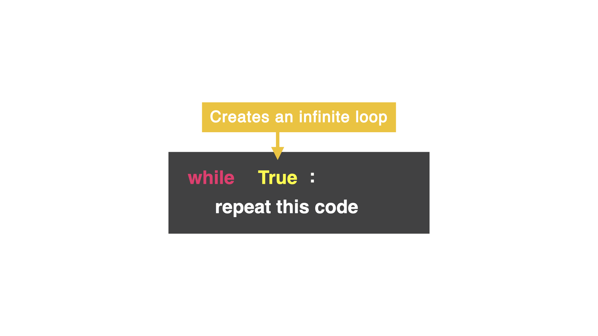

# while True Loop

On Day 15, you learned how to create a `while` loop. However, there are a lot of moving parts that can turn the `while` loop into an accidental infinite loop...and a nightmare.

## Introducing the while True loop...




### 👉Let's try it out. 
What do you think the below code does? 

Remember you can use the big Stop button on the top if your program does not end.

```python
while True:
  print("This program is running")
print("Aww, I was having a good time 😭")
```

This type of loop only has two conditions: `True` and `False`. *Make note of the capital "T" and "F".*

<details> <summary> Fun Fact </summary>
A Boolean Loop has two values: True or False. Impress your friends and tell them you know how to use a Boolean Loop. 
</details>


In this loop, I am saying to the computer:

"while True is True...do this over and over again."


### Yes, we made an infinite loop, but hold on...