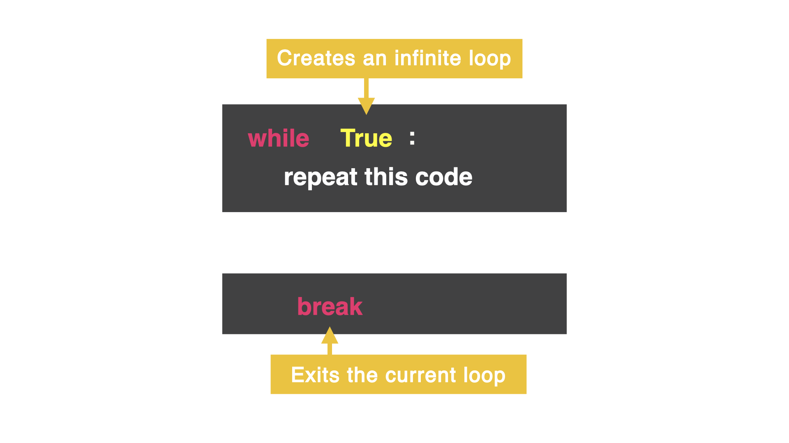

# Make it stop

There is a way to stop the loop with the word `break`. This exits the loop and stops all code at that point. Even if there is more code written after `break` that is *inside* the loop. 

After `break`, the computer jumps out of the loop to the next *unindented* line of code.



## 👉 Let's try it out

`Run` the code below and notice how the loop will continue until `break`. Then the next line of *unindented* code will run.

```python
while True:
  print("This program is running")
  goAgain = input("Go again?: ")
  if goAgain == "no":
    break
print("Aww, I was having a good time 😭")